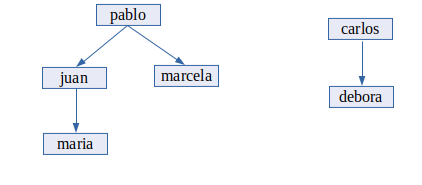

# Prolog

Prolog es un lenguaje interpretado que soporta el paradigma de **programación lógica**. 

La programación lógica encuentra su hábitat natural en aplicaciones de inteligencia artificial o relacionadas:

- **Sistemas expertos**, donde un sistema de información imita las recomendaciones de un experto sobre algún dominio de conocimiento.
- **Demostración automática de teoremas**, donde un programa genera nuevos teoremas sobre una teoría existente.
- **Reconocimiento de lenguaje natural**, donde un programa es capaz de comprender (con limitaciones) la información contenida en una expresión lingüística humana.

Existen varias implementaciones del lenguaje, de las cuales las más conocidas son:
- GNU Prolog
- SWI-Prolog

## Instalación

Dichas implementaciones pueden instalarse en Linux con:

```bash
sudo  apt  install  gprolog  swi-prolog
```

## HolaMundo en Prolog

Para ejecutar el interprete de GNU, ejecutamos `gprolog`.

Escribimos el siguiente código y pulsamos intro:

```prolog
 write('Hola mundo').
 ```
 Nos aparecerá algo parecido a lo siguiente:
 
 ```
 GNU Prolog 1.3.0
By Daniel Diaz
Copyright (C) 1999-2007 Daniel Diaz
| ?-  write('Hola mundo').
Hola mundo

yes
```

El código anterior es una **consulta**. 

La línea de comandos anterior solo permitirá emitir consultas. Para indicar las **reglas** y los **hechos** necesitamos crear un archivo y escribir el código allí. 

Un ejemplo más elaborado es el siguiente. 

Tenemos un archivo `familia.pl` que contiene los hechos y las reglas.

```prolog
%%  HECHOS

padre('juan', 'maria').    % juan es padre de maria
padre('pablo', 'juan').    % pablo es padre de juan
padre('pablo', 'marcela'). % pablo es padre de marcela
padre('carlos', 'debora'). % carlos es padre de debora


%% REGLAS

% A es hijo de B si B es padre de A
hijo(A,B) :- padre(B,A).

% A es abuelo de B si A es padre de C y C es padre B
abuelo(A,B) :- 
   padre(A,C), 
   padre(C,B).

% A y B son hermanos si el padre de A es también el padre de B y si A y B no son lo mismo
hermano(A,B) :- 
   padre(C,A), 
   padre(C,B), 
   A \== B.        

% A y B son familiares si A es padre de B o A es hijo de B o A es hermano de B
familiar(A,B) :- 
   padre(A,B).
familiar(A,B) :-
   hijo(A,B). 
familiar(A,B) :- 
   hermano(A,B).
```

La relación entre las distintas personas queda así:




Invocamos el intérprete `gprolog`.

Una vez hecho esto cargamos el archivo `familia.pl` y ejecutamos varias consultas:

```
GNU Prolog 1.3.0
By Daniel Diaz
Copyright (C) 1999-2007 Daniel Diaz
| ?- [familia].
compiling /home/jose/Proyectos/DAW1-ED-HolaMundo/codigo/familia.pl for byte code...
/home/jose/Proyectos/DAW1-ED-HolaMundo/codigo/familia.pl compiled, 56 lines read - 1818 bytes written, 8 ms

yes
| ?- hermano('juan', 'marcela').

true ? 

yes
| ?- hermano('carlos', 'juan').

no
| ?- abuelo('pablo', 'maria').

true ? 

yes
| ?- abuelo('maria', 'pablo').

no
```

Para salir del interprete pulsamos `Ctrl+D`.


También existen un compilador llamado `gplc`. Para compilar el código anterior, hacemos:

```
gplc familia.pl
``` 

Lo ejecutamos como `./familia` y a continuación podremos realizar las consultas deseadas.


## Referencias

- [Prolog en Wikipedia](https://es.wikipedia.org/wiki/Prolog)
- [Implemantaciones de Prolog](https://en.wikipedia.org/wiki/Comparison_of_Prolog_implementations)
- [Tutorial básico de Prolog](https://portal.uah.es/portal/page/portal/GP_EPD/PG-MA-ASIG/PG-ASIG-78010/TAB42351/Tutorial_Basico_Prolog.pdf)
- [TRY LOGIC PROGRAMMING! A GENTLE INTRODUCTION TO PROLOG](https://bernardopires.com/2013/10/try-logic-programming-a-gentle-introduction-to-prolog/)
- [Prolog: A Tutorial Introduction by James Lu and Jerud Mead (PDF)](https://classes.soe.ucsc.edu/cmps112/Spring03/languages/prolog/PrologIntro.pdf)
- [Executing Prolog code](http://www.swi-prolog.org/FAQ/ToplevelMode.html)
- [Sitio oficial de GNU Prolog](http://www.gprolog.org/)

